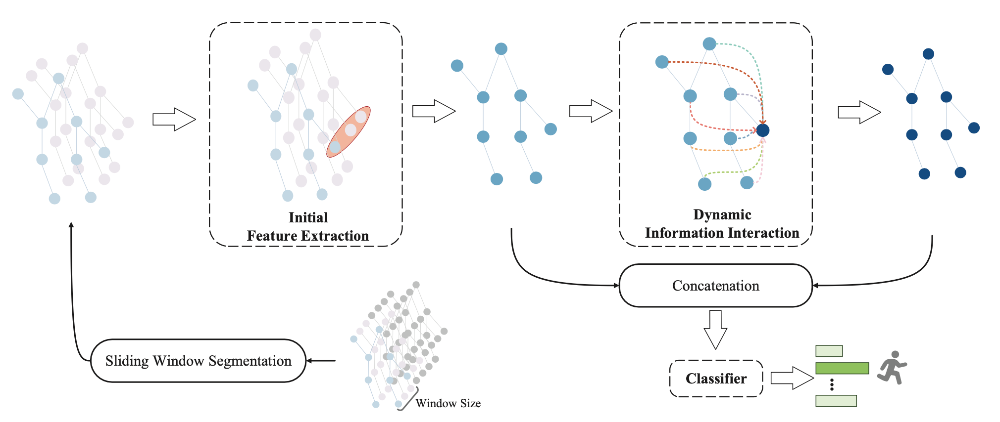
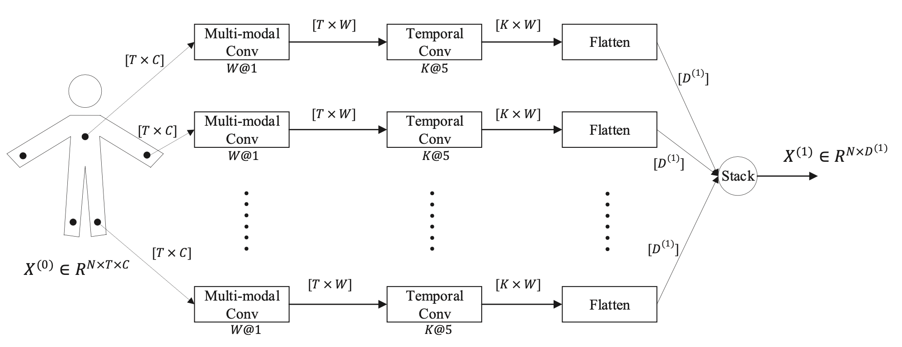
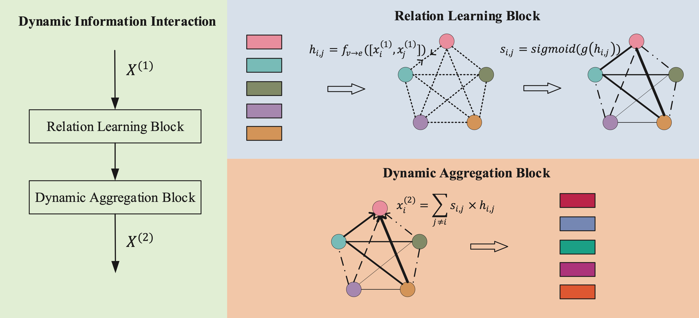

# 1 DynamicWHAR
This is the official implementation of paper ["Towards a Dynamic Framework for Multi-Sensor-Based Wearable Human Activity Recognition"](https://dl.acm.org/doi/10.1145/3550331). Accepted by PACM IMWUT / UbiComp 2022.

In this paper, we propose a lightweight yet efficient GCN-based dynamic inter-sensor correlations learning framework called DynamicWHAR for automatically learning the dynamic correlations between sensors.

<p align="center">
  
</p>

In Initial Feature Extraction module, the initial features of each sensor is extracted separately. The architecture of Initial Feature Extraction module is shown below.

<p align="center">
  
</p>


In Dynamic Information Interaction module, the dynamic correlations between sensors are learned automatically, and each sensor aggregates the information of other sensors according to their specific correlations. The architecture of Dynamic Information Interaction module is shown below.

<p align="center">
  
</p>

# 2 Prerequisites
- Python 3.6.12
- PyTorch 1.2.0
- math, sklearn, tensorboardX
 
# 3 Data Preparation

For your convenience, the preprocessed data is provided [here](https://drive.google.com/drive/folders/1ZyoBbMSjj0vkZl54EA_nHD9Yi8JO9tdv?usp=sharing).

- Put the preprocessed data into the following directory structure
 ```python
- Dataset/
  - opp/
    - opp_24_12/
    - opp_60_30/
       ... # preprocessed data of Opportunity
  - realworld/
    - realworld_40_20/
    - realworld_100_50/
       ... # preprocessed data of RealWorld
  - realdisp/
    - realdisp_40_20/
    - realdisp_100_50/
       ... # preprocessed data of Realdisp
  - skoda/
    - skoda_right_78_39/
    - skoda_right_196_98/
       ... # preprocessed data of Skoda
  ```  
Links of raw datasets:
 - OPPORTUNITY:  https://archive.ics.uci.edu/ml/datasets/OPPORTUNITY+Activity+Recognition
 - RealWorld: https://sensor.informatik.uni-mannheim.de
 - Realdisp: https://archive.ics.uci.edu/ml/datasets/REALDISP+Activity+Recognition+Dataset
 - Skoda: http://har-dataset.org/doku.php?id=wiki:dataset

# 4 Training & Testing

Here is the descriptions about the arguments:
| Argument| Description |
| --- | --- |
| model | The model name (default='DynamicWHAR') |
| dataset | The dataset name (default='opp_24_12') |
| Scheduling_lambda | The scheduling lambda (default=0.995) |
| test_user | The ID of test user (default=0) |
| seed | The random seed (default=1) |
| no_cuda | Disables CUDA training (default=False) |

You can change the config depending on what you want:
```python
python main.py --model <model>  --dataset <dataset> --Scheduling_lambda <scheduling_lambda>  --test_user <test_user>  --seed <seed> --no_cuda <no_cuda>
```

# 5 Citation

If you find this work useful, please consider to cite as follows:

    @article{miao2022towards,
        title={Towards a Dynamic Framework for Multi-Sensor-Based Wearable Human Activity Recognition},
        author={Shenghuan Miao and Ling Chen and Rong Hu and Yingsong Luo},
        journal={Proceedings of the ACM on Interactive, Mobile, Wearable and Ubiquitous Technologies},
        volume={6},
        number={3},
        pages={1--25},
        year={2022},
        publisher={ACM New York, NY, USA}
    }

# 6 Acknowledgements
  
We wish to thank the reviewers for your highly valuable comments on the paper.
